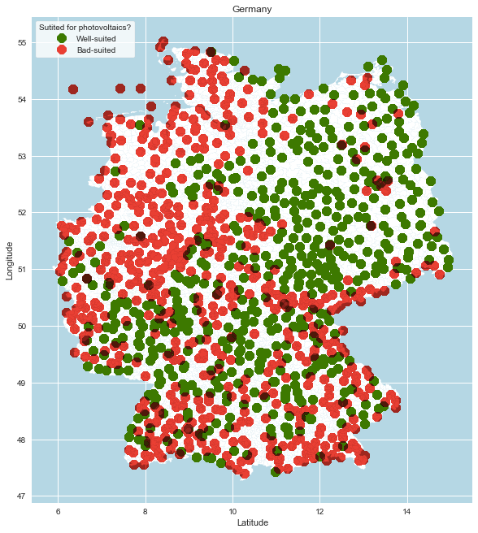
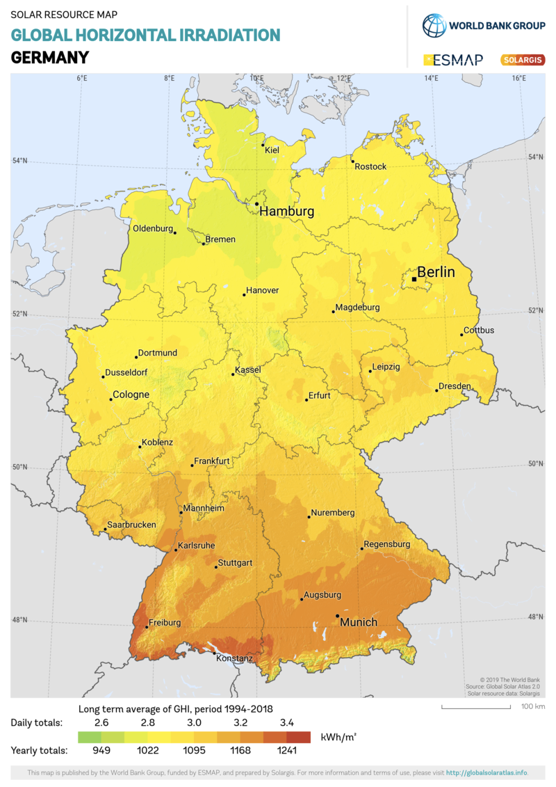
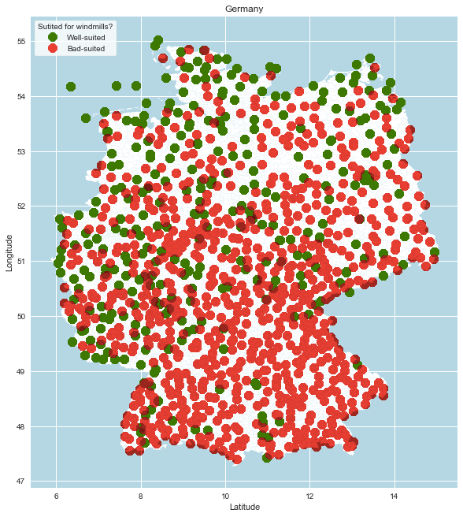
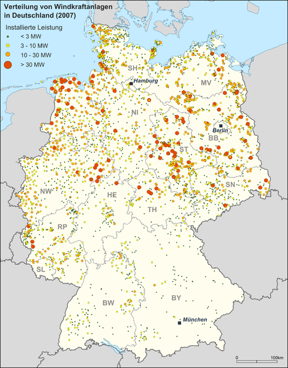

# Green_Energy_Locations
___
💭  **Idea:**

It is unclear where the optimal locations for wind and solar energy are. For example this could be a problem for homeowners who plan to build a solar system.  

💡  **Potential solution:** 

Analyze solar and wind data. Also consider infrastructure and legal requirements to create a map with optimal locations.

___

## 1. Idea and Goal:

- Analyse wind and solar data
- Look at legal requirements as well as meterological data (wind speeds, sunlight hours, etc.) and consisting infrastructure (high voltage lines)
- Show these locations a map (Highlight the best locations with a colour-ranking)
- Optional: Calculate the amout energy that can be produced at a specific location
- Optional: Calculate the break even-point

**→ Goal: Recommend ideal locations for solar or wind parks**
___

## 2. Description

In the following, we are going to describe our understanding of the business question or problem, analytical question and/or technical problem associated with the use case.

**What are the challenges that need to be mastered?**

### 2.1. Setup Github structure:
- Issues & Cards on Kanban-Board
- Create a environment where all group members can work together and stay up-to-date

### 2.2. DataFrame:
- Find a suitable database, to download relevant meterological data for wind and solar
- Create a Dataframe, which contains relevant input variables for the machine learning model
- Link to DataFrame einfügen

### 2.2. Solar-Model:
- Which input-variables for the model: 
  - Solar: hours of sun
  - How many hours of sunlight is needed for a solar power plant?
- What is the output-variable and how is it defined?
  - Is the location suitable for photovoltaic?
  - (Beispiel) If the location is better than 60% of the other stations, it is defined as Suitable>- Notebook for Data Preparation: http://tiny.cc/dataprep_tl (link in unserem Github Ornder einfügen)
- Train different Machine-learning models and fit them with the help of Hyperparametertuning and a cross-validation
    - Bild einfügen von Boxplot welcher zeigt, welches Modell am Besten war?
    - Notebook for Data Preparation: (link in unserem Github Ornder einfügen)
  
### 2.3. Wind-Model:
- Which input-variables for the model: 
  - average wind speed
  - How many hours of wind is needed for a wind mill? 4-25m/s (14,4-90kmh) 
- What is the output-variable and how is it defined?
  - Is the location suitable for a windmill?
  - (Beispiel) If the location is better than 60% of the other stations, it is defined as Suitable
- Train different Machine-learning models and fit them with the help of Hyperparametertuning and a cross-validation
  - Bild einfügen von Boxplot welcher zeigt, welches Modell am Besten war?
  - Notebook for Data Preparation: (link in unserem Github Ornder einfügen)

### 2.4. Map:
- Setup Map:
  - Plot a map of Germany 
  - Plot each location with latitude and longitude on the map
  - Whether a location is suitable for a solar-plant or windmill, it is plotted as a green dot
  - Whether a location is not suitable for a solar-plant or windmill, it is plotted as a red dot
- Compare the 
    
### 2.5. Pitch/Presentation:
  - Prepare a Presentation/Pitch to present our task, approach and finding to the other techies at Tech-Labs Düsseldorf
  - Create a Blogpost 
  
# 3. Achievements:

### 3.1 Solar-Plants

**Map of potential solar-plants in Germany** 

**Map of existing solar-plants in Germany**

### 3.2 Windmills

**Map of potential windmills in Germany** 

**In comparison: Map of existing windmills in Germany**

