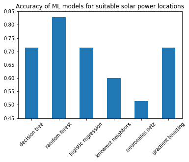
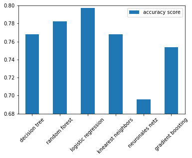
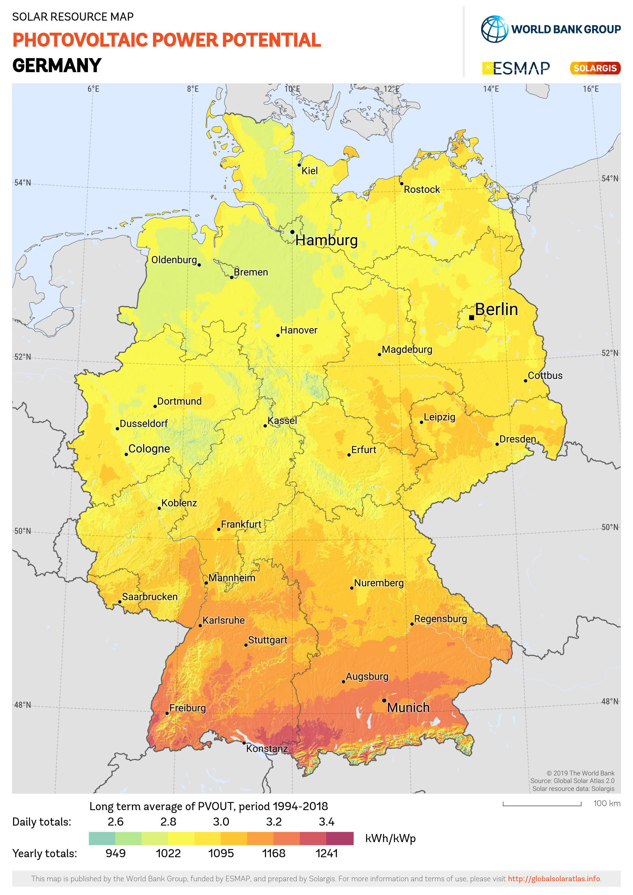
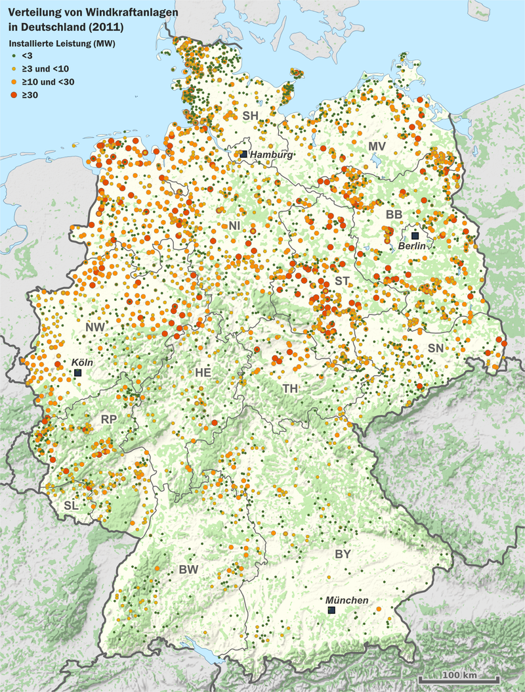

# Green_Energy_Locations
___
💭  Idea: It is unclear where the optimal locations for wind and solar energy are. For example this could be a problem for homeowners who plan to build a solar system.  
💡  Potential solution: Analyze solar and wind data. Also consider infrastructure and legal requirements to create a map with optimal locations.

___

## 1. Idea and Goal:

- Analyse wind and solar data
- Look at legal requirements as well as meteorological data (wind speeds, sunlight hours, etc.) and consisting infrastructure (high voltage lines)
- Show these locations a map (Highlight the best locations with a colour-ranking)
- Optional: Calculate the amount energy that can be produced at a specific location
- Optional: Calculate the break even-point

**→ Goal: Recommend ideal locations for solar or wind parks**
___

## 2. Description

In the following, we are going to describe our understanding of the business question or problem, analytical question and/or technical problem associated with the use case.

**What are the challenges that need to be mastered?**

### 2.1. Setup Github structure:
- Issues & Cards on Kanban-Board
- Create an environment where all group members can work together and stay up-to-date

### 2.2. DataFrame:
- Find a suitable database, to download relevant meteorological data for wind and solar
- Create a Dataframe, which contains relevant input variables for the machine learning model

### 2.2. Solar-Model:
- Which input-variables for the model: 
  - Solar: hours of sun
  - How many hours of sunlight is needed for a solar power plant?
    - Therefore, we chose the hours of sunshine and the clearness of the sky
- What is the output-variable and how is it defined?
  - Is the location suitable for photovoltaic?
  - If the location is better than 60% of the other stations, it is defined as Suitable
  - Train different Machine-learning models and fit them with the help of Hyperparametertuning and a cross-validation
  
    
  - We chose the random forest because it performed best
  - Notebook for Data Preparation: code/solarmodel_means.ipynb
  
### 2.3. Wind-Model:
- Which input-variables for the model: 
  - average wind speed 
- What is the output-variable and how is it defined?
  - Is the location suitable for a windmill? 
  - If the mean windspeed of the location is higher than 60% of the other stations, it is defined as Suitable
- Train different Machine-learning models and fit them with the help of Hyperparametertuning and a cross-validation
  - How do we get the most accurate model? 
  - Training the model with the standard deviation input variables results in the highest accuracy

  
  - -> compare accuracy of different models:
  - logistic_regression_train shows the highest accuracy score we still chose to use the random_forest_train because log_reg led to a large number of negatives

  
  - Notebook for Data Preparation: code/windmodel_deviations.ipynb

### 2.4. Map:
- Setup Map:
  - Plot a map of Germany 
  - Plot each location with latitude and longitude on the map
  - Whether a location is suitable for a solar-plant or windmill, it is plotted as a green dot
  -Whether a location is not suitable for a solar-plant or windmill, it is plotted as a red dot
- Compare the plots with maps that show the actual windmills and solar plants in Germany
    
### 2.5. Pitch/Presentation:
  - Prepare a Presentation/Pitch to present our task, approach and finding to the other techies at Tech-Labs Düsseldorf
  - Create a Blogpost 
  
# 3. Achievements:

**Map of potential solar-plants in Germany**

**In comparison: Map of existing solar-plants in Germany**

**Map of potential windmills in Germany**

**In comparison: Map of existing windmills in Germany**

